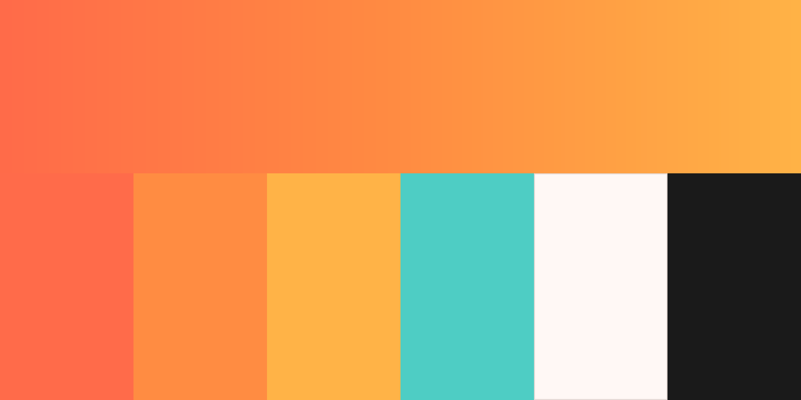

# Keeper brand sheet

Source of truth: the live site, [keeperlockers.com](https://www.keeperlockers.com). If this sheet and the site disagree, the site wins.

## Name

- Brand: **Keeper**. Write it like that in titles and supers.
- Company (legal lines only): Keeper Lockers UG (haftungsbeschränkt). Never "GmbH".
- Mascot: **Keevy**, the little suitcase. Keevy is the character, not the logo.
- Claim: **Explore Your Freedom**
- Domain: keeperlockers.com

## Colour

| Name | Hex | Use |
|---|---|---|
| Coral | `#FF6B4A` | Primary. Headline accents, buttons |
| Orange | `#FF8C42` | Middle of the gradient |
| Marigold | `#FFB347` | End of the gradient |
| Teal | `#4ECDC4` | The only cool accent. Small doses |
| Cream | `#FFF8F5` | Light backgrounds |
| Ink | `#1A1A1A` | Text, dark backgrounds |
| Muted | `#6B6B6B` | Secondary text |

**Signature gradient:** coral → orange → marigold at 135°
`linear-gradient(135deg, #FF6B4A 0%, #FF8C42 50%, #FFB347 100%)`

Keevy's own body runs warm orange at the top to teal-blue at the bottom. That is why teal belongs in the palette. The lockers in the illustrations carry the same top-to-bottom fade.

### Logo, splash and end cards

| Name | Hex | Use |
|---|---|---|
| Arch orange (left) | `#FD7A35` | Logo arch and dot, start of gradient |
| Arch orange (right) | `#FEA33D` | Logo arch, end of gradient |
| Hill teal (left) | `#077072` | Logo hill, start of gradient |
| Hill teal (mid) | `#079A97` | Logo hill, middle |
| Hill teal (right) | `#0CA3A0` | Logo hill, end of gradient |
| Path white | `#FFFFFF` | Logo path, white logo versions |
| Splash cream | `#FCF4EC` | Background of the splash video and the cream end card |
| Splash cream light | `#FFF9F3` | Centre glow on the cream end card |
| Pill orange | `#F26A2E` | "Starting in Berlin" pill on the end cards |

The logo colours were sampled from the splash video, so they may be a shade off whatever the symbol was designed with.

There are two teals: the logo's deep teal (`#077072`–`#0CA3A0`) and the website's light accent teal (`#4ECDC4`). Use the deep one with the logo.

Every hex above is also in `brand/colors.css` and `brand/colors.json`.

## Type

| Role | Font | Notes |
|---|---|---|
| Headlines, big numbers | **Bricolage Grotesque** | Bold / ExtraBold, tight tracking |
| Body, captions, UI | **DM Sans** | Regular / Medium / Bold |

Both are free (SIL Open Font License). Variable TTFs are in `brand/fonts/` — install them and pick the weight in your editor.

## Logo

The logo is the **arch-and-path symbol + the word "Keeper"** set in Bricolage Grotesque ExtraBold. The symbol is the one the main splash (`video/MAIN-splash-1080x1920.mp4`) builds: an orange arch with a dot, over a teal hill with a white winding path.

| File | Use |
|---|---|
| `keeper-lockup-horizontal-color-ink` | Main logo on light backgrounds |
| `keeper-lockup-horizontal-color-white` | Colour symbol, white wordmark — dark backgrounds |
| `keeper-lockup-horizontal-white` / `-ink` | One-colour versions — over photos, the gradient, or anywhere colour fights |
| `keeper-lockup-stacked-*` | Same four, symbol above the wordmark |
| `keeper-symbol-color` / `-white` / `-ink` | Symbol alone |
| `keeper-wordmark-ink` / `-white` / `-coral` | Wordmark alone |

Every file exists as vector in `brand/logo/svg/` and as a transparent PNG in `brand/logo/png/`.

Logo colours: arch `#FD7A35` → `#FEA33D`, hill `#077072` → `#0CA3A0`, path white. On the coral gradient use the white one-colour version — the orange arch disappears into it.

The symbol was traced from the last frame of the splash video, so edges are close but not designer-exact. If an original vector of the symbol turns up, it should replace these.

`brand/logo/current-website-icons/` holds the Keevy favicon and share image the website still uses. Don't use them as the logo.

Ready-made end cards (4K, vertical and horizontal, cream and gradient) are in `end-cards/`, with empty backgrounds in `end-cards/background-only/`. The cream card uses the splash's background colour (`#FCF4EC`), so the splash can cut straight into it.

## Keevy

- Soft, matte, rounded suitcase with a fixed loop handle, dot eyes, small smile, stubby arms and legs.
- Friendly and a bit cheeky. Annoyed only when hauling luggage or paying by the coin (`keevy-struggle`, `keevy-angry-coins`) — those two are the "before Keeper" poses.
- Don't stretch, recolour or add a mouth full of teeth to the happy poses. Don't put a telescoping trolley handle on Keevy.
- `brand/mascot-keevy/hi-res/*-transparent-4k.png` are the four hero poses (wave, celebrate, struggle, walk) at ~2700px on transparent backgrounds — use these full-frame.
- `brand/mascot-keevy/poses/` are 26 more transparent poses around 600px — fine as small on-screen elements.

## Look and feel

Warm, bright, optimistic. Golden-hour light, people moving freely with empty hands. Cream and coral, never cold corporate blue. Rounded corners everywhere. Motion is calm for navigation and playful only at the happy moments (locker opens, bag is stored, walking away free).

## Voice

Short, plain, confident. Says what it costs and how it works without hype.

- "Drop your bags. Explore freely."
- "Pay per minute, not per hour."
- "No keys. No coins. No queues."
- "Travel light."

German uses "du".
